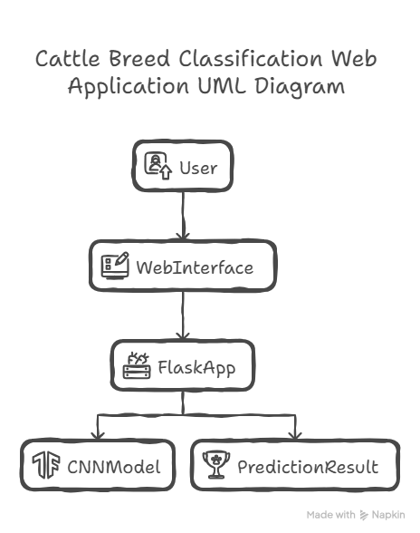
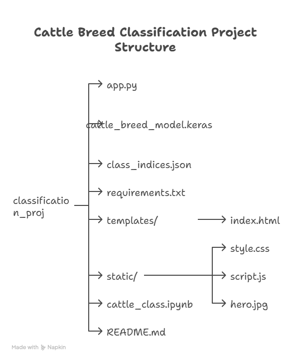
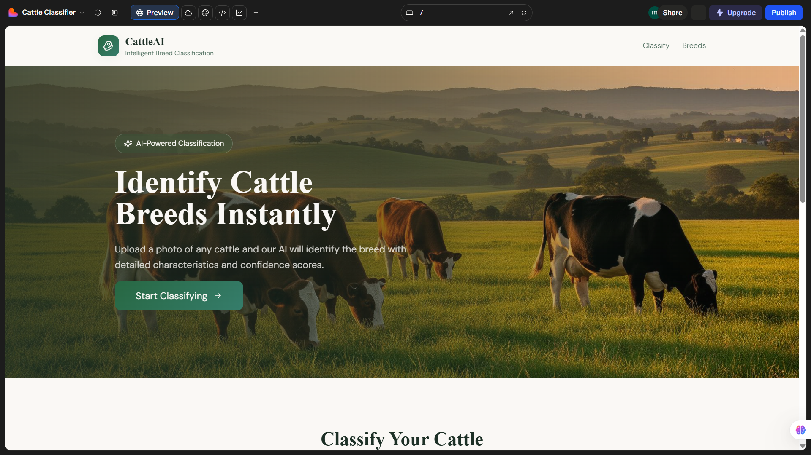
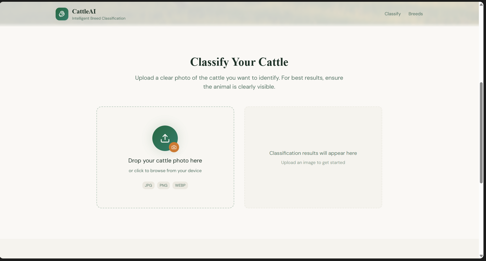

🐄 Cattle Breed Classification System (CattleAI)

An end-to-end deep learning–based web application that identifies cattle breeds from images using a Convolutional Neural Network (CNN) with transfer learning, deployed via a Flask web interface.

📌 Project Overview

Cattle breed identification is a challenging fine-grained image classification problem due to high visual similarity between breeds.
This project leverages deep learning and transfer learning to automatically classify cattle breeds from uploaded images and display predictions through a user-friendly web interface.

The system allows users to upload a cattle image and instantly receive:
    Predicted breed name
    Prediction confidence

🚀 Features

    🧠 CNN-based cattle breed classification
    🔁 Transfer learning with fine-tuning
    🛑 Overfitting control using EarlyStopping and learning-rate scheduling
    🌐 Web interface built using HTML, CSS, JavaScript, and Bootstrap
    ⚙️ Flask backend for model inference
    📊 Model evaluation using confusion matrix and classification report

🧠 Cattle Breeds Classified

The model is trained to classify the following breeds:
    1. Ayrshire cattle
    2. Brown Swiss cattle
    3. Holstein Friesian cattle
    4. Jersey cattle
    5.Red Dane cattle

🛠️ Tech Stack
Machine Learning & Backend
    
    Python
    
    TensorFlow / Keras
    
    NumPy
    
    Pillow (PIL)
    
    Flask
    
    SciPy

Frontend
   
    HTML5
   
    CSS3
   
    JavaScript
   
    Bootstrap 5

Tools
   
    VS Code
   
    Git & GitHub

## 🔄 Application Workflow

This diagram illustrates the end-to-end workflow of the application, from image upload 
to final cattle breed prediction.

## Architecture Diagram

🧪 Model Training Details

Approach: Transfer Learning

Base Model: Pretrained CNN (MobileNet / similar)

Training Strategy:
    
    Freeze pretrained layers (feature extraction)
    
    Train custom classification head
    
    Fine-tune top layers with low learning rate

Overfitting Prevention Techniques
   
    EarlyStopping
   
    ReduceLROnPlateau
   
    Dropout layers 
   
    Data augmentation

📊 Model Evaluation

The model was evaluated using:
    
    Accuracy
    
    Confusion Matrix
    
    Precision, Recall, and F1-score

Web Application Workflow
    
    User uploads a cattle image
    
    Image is sent to Flask backend
    
    Image is processed using Pillow
    
    CNN model predicts breed
    
    Result is returned and displayed on the webpage

▶️ How to Run the Project Locally
    
    1. Clone the Repository
    
        git clone https://github.com/your-username/Classification_proj.git
    
        cd Classification_proj
    
    2. Create and Activate Virtual Environment
       
        python -m venv .venv
       
        source .venv/Scripts/activate   # Windows
    
    3. Install Dependencies
        
        pip install -r requirements.txt

🔮 Future Enhancements
    
    Collect larger and more diverse datasets
    
    Use stronger architectures (EfficientNet, ResNet)
    
    Improve accuracy using attention mechanisms
    
    Deploy application online (Render / Railway)
    
    Convert model to TensorFlow Lite

🎯 Learning Outcomes
    
    Built an end-to-end ML pipeline
    
    Gained hands-on experience with CNNs
    
    Learned transfer learning and fine-tuning
    
    Understood overfitting control techniques
    
    Integrated ML models into web applications

## 🖥️ Web Application Output

### Home Page

### Prediction Result

The application displays the predicted cattle breed along with confidence score.

